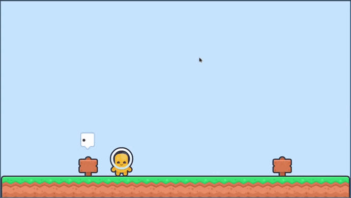
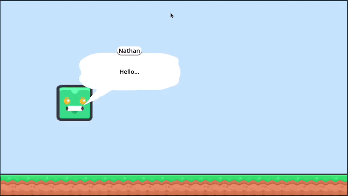
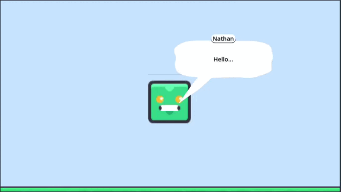

# BalloonBubble Example

A dialogue bubble system example built with the Dialogue Manager addon for the Godot game engine.

# OVERVIEW

This project demonstrates how to implement interactive dialogue bubbles in Godot using the popular Dialogue Manager plugin. It provides a foundation for creating conversation systems, character interactions, and narrative elements in your games.

FEATURES

- Godot-based dialogue system
- Dialogue Manager integration for easy conversation scripting
- Bubble UI elements for displaying character speech
- Well-organized project structure with scenes, scripts, and resources

# GETTING STARTED

- Review the dialogue files in the dialog/ folder to understand the conversation structure
- Check the scenes/ folder to see how dialogue bubbles are implemented
- Examine scripts/ to see how Dialogue Manager is integrated with your gameplay

# EXAMPLES

Easy balloon position management

Text always on screen

Text mantain the size
